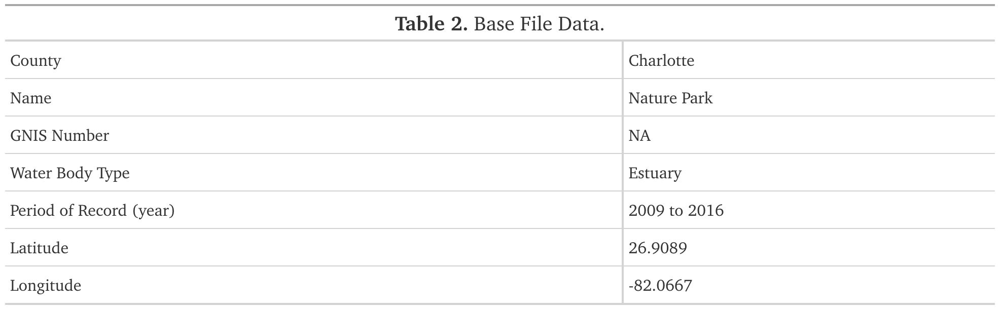
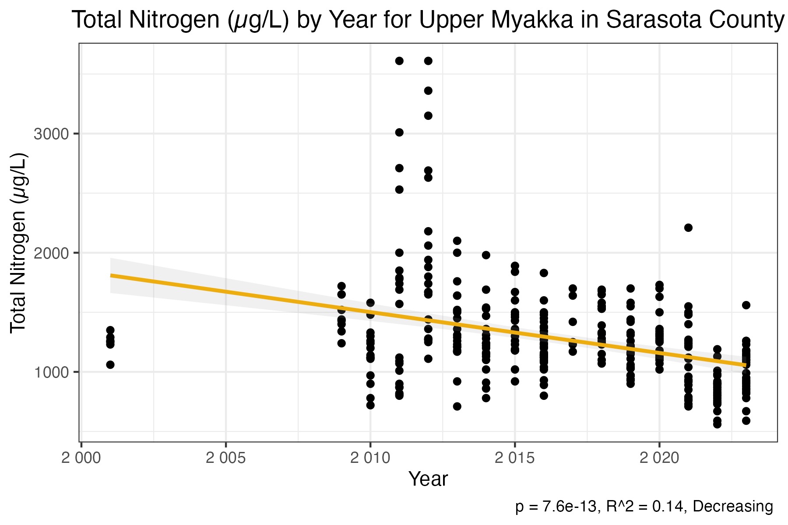
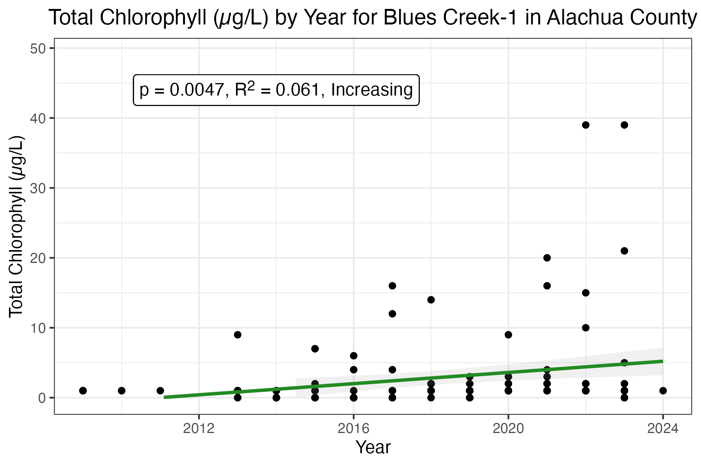
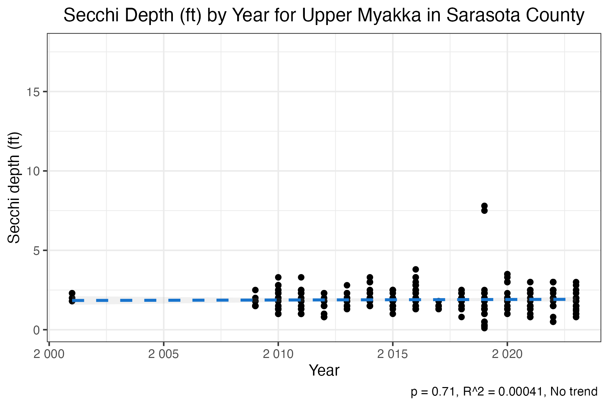

---
output:
  pdf_document: default
  html_document: default
params:
  Lakes: 0
editor_options: 
  markdown: 
    wrap: sentence
---

```{r tinytex update, include=FALSE}
#tinytex::tlmgr_update()
```

```{r document option, include=FALSE}

#this line will hit all code chunks
##change to echo = TRUE to diagnose code issues
knitr::opts_chunk$set(echo = FALSE)
#this will suppress any warning messages related to all the code, including warnings about statistics. 
####change to echo = TRUE to diagnose statistical issues
knitr::opts_chunk$set(warning = FALSE)
#this hids code messages, in particular "`geom_smooth()` using formula = 'y ~ x'" from the graphs
##change to echo = TRUE to diagnose code issues
knitr::opts_chunk$set(message = FALSE)


#have to add this. this code tells rmarkdown to not try remove html tags, allows for use of html to format GT table objects.
options(gt.html_tag_check = FALSE)


```

```{r data_processing,  eval=TRUE}
###IMPORTING LIBRARIES AND LOADING DATA###
##########################################################################################
#Commenting out this code to add to the for loop file
#importing libraries 
#library(tidyverse)
#library(gt)
#library(SciViews)
#library(broom)
#broom is just to get values form lm function in easier to reference from
#library(glue)
#library(ggtext)
#glue and ggtext are for making labels. trying to make labels and get default ggplot functions to correctly parse those labels is a nightmare. ggtext helps by allowing you to use html tags in the labels. glue helps by allowing you to use variables in the labels.
#library(readxl)

### Loading and Preparing Data

# path <- "C:/Users/amber.riner/Documents/LWreports"
# setwd(path)
# 
# data_1 = read_xlsx("Lakewatch Base File 10-24-2023.xlsx")
# data_1 <- data_1 %>%
#   mutate(Lake_County = paste(Lake, County)) %>%
#   filter(Study == "LW") %>%
#   filter(`water type` == "Lake") 
# head(data_1)
# 
# data_2 = read.csv("All_Data.csv")
# data_2 = data_2 %>%
#   mutate(Station = as.character(Station)) %>%
#   mutate(Lake_County = paste(Lake, County)) 
# head(data_2)
# 
# data_all <- data_1 %>% full_join(data_2, by = c("Lake_County", "Station"))
# 
# Lake = data_all %>% filter(Lake_County == "Alice Alachua") #subsetting data for lake alice

##################################################################################

###FUNCTIONS###

#calculates geometric mean
gmean <- function(x){
  xc <- x[!is.na(x)]
  xg <- exp(mean(log(xc[xc>0])))
  xg <- round(xg)
  return(xg)
} 

#adding a column using if/else for lake classification
##this code currently has no fallback for if the data is missing.
#Lake_2 = Lake_2 %>% mutate(lake_class = ifelse(
  #gmean(`Color`) > 40, "Colored", ifelse(
  #  gmean(`Color`) <= 40 & gmean(`Cond_uS`) <= 20, "Clear Soft Water","Clear Hard Water")))

#adding a column using if/else for trophic state

#Lake_2 = Lake_2 %>% mutate(trophic_state = ifelse(
  #gmean(CHL) < 3, "Oligotrophic", ifelse(
   # gmean(CHL) >= 3 & gmean(CHL) < 7, "Mesotrophic", ifelse(
      #gmean(CHL) >= 7 & gmean(CHL) < 40, "Eutrophic", "Hypereutrophic"))))


```

```{r title,  echo=FALSE}
report_title = glue("Florida LAKEWATCH Report for  {Lake_2$Lake[1]} in {Lake_2$County[1]} 2024", )

#Need to add "Estuary and Estuary Segment:" which is in Basefile MS
```

## `r report_title`

## Estuary and Estuary Segment:

### Introduction for Estuaries

This report summarizes data collected on systems that have been part of the LAKEWATCH program.
Data are from the period of record for individual systems.
The first part of this summary lists background data for each system, the second part lists the long-term data averages and ranges and the final part are trend plots for nutrients, chlorophyll, and Secchi depth. Plots were only made for systems with five or more years of data.
For more information about the study of Florida waters, please see our series of information circulars "A Beginner’s Guide to Water Management" (<https://lakewatch.ifas.ufl.edu/extension/information-circulars/>).

The near shore Florida coastline is separated into estuary and estuary segments within the estuary.
Deeper coastal waters are separated into coastal nutrient regions and coastal nutrient segments within the regions.
Numeric nutrient criteria are established for all estuary segments, including criteria for total nitrogen, total phosphorus, and chlorophyll a.
For open ocean coastal waters, numeric criteria are established for chlorophyll a, that is derived from satellite remote sensing techniques.
For those locations without defined segments there are narrative nutrient criteria (e.g., Florida Keys Halo Zone).

The maps defining individual estuaries and coastal segments can be found at the following link: <https://www.flrules.org/Gateway/reference.asp?No=Ref-05420>

The individual nutrient criteria can be found at the following link: <https://www.flrules.org/gateway/RuleNo.asp?title=SURFACE%20WATER%20QUALITY%20STANDARDS&ID=62-302.532>

### Base File Data for Estuaries: Definitions

-   **County:** Name of county in which the system resides.
-   **Name:** Stream name that LAKEWATCH uses for the system.
-   **GNIS Number:** Number created by USGS's Geographic Names Information System.
-   **Water Body Type:** Four different types of systems; lakes, estuaries, river/streams and springs.
-   **Period of Record (years):** Number of years a system has been in the LAKEWATCH program.
-   **Latitude and Longitude:** Coordinates identifying the exact location of station 1 for each system.

```{r table_1_data}

#define variables
cnty <- Lake_2$County[1] #county
name <- Lake_2$Lake[1] #name
gnis <- Lake_1$GNIS_ID[1]
wbt <- Lake_1$`water type`[1]
pr <- paste(min(Lake_2$Year), " to ", max(Lake_2$Year)) #period of record
lat <- round(Lake_1$Latitude[1], 4)
long <- round(Lake_1$Longitude[1], 4)


#add values to array
rowval <- c(cnty, name, gnis, wbt, pr, lat, long)

#add row names to array – see if you can change pr "year" to "years, range" MS
rowname <- c("County", "Name", "GNIS Number", "Water Body Type", "Period of Record (year)", "Latitude", "Longitude")


#make dataframe with rownames and row values
tbl2df <- data.frame(rowname, rowval)
#make gt table
table_two = gt(tbl2df) %>% tab_options(column_labels.hidden = TRUE) %>% fmt_number(
  decimals = 1
) %>% opt_table_font(
  stack = "transitional"

) %>% tab_options(
    table.width = pct(100),
  
) %>% tab_header(title = md("**Table 2.** Base File Data.")
  )  

gtsave(table_one, filename = "table_1.png", path = "estuary/output_table")

```

```{r table 1, out.width= "500px", fig.align='center'}
knitr::include_graphics("estuary/output_table/table_1.png")
```

\newpage

### Long-Term Data for Estuaries: Definitions

The following long-term data are the primary trophic state parameters collected by LAKEWATCH volunteers and classification variables color and specific conductance (LAKEWATCH recently began analyzing samples quarterly for color and specific conductance):

-   **Total Phosphorus (µg/L):** Nutrient most often limiting growth of plant/algae.

-   **Total Nitrogen (µg/L):** Nutrient needed for aquatic plant/algae growth but only limiting when nitrogen to phosphorus ratios are generally less than 10 (by mass).

-   **Chlorophyll-uncorrected (µg/L):** Chlorophyll concentrations are used to measure relative abundances of open water algae.

-   **Secchi (ft), Secchi (m):** Secchi measurements are estimates of water clarity.

-   **Color (Pt-Co Units):** LAKEWATCH measures true color, which is the color of the water after particles have been filtered out.

-   **Specific Conductance (µS/cm \@ 25 C):** Measurement of the ability of water to conduct electricity and can be used to estimate the amount of dissolved materials in water.

```{r table_2_data}


#note: these tables work but it has two issues at the moment
##one is that is is not using the geometric mean, just mean. 
### it is using the min and max value, when we want the min and max mean value across ampling years
#it is also missing the number of sampling years for each variable. i need to work on calculating that. so far i can't figure out how to do that. 
#another issue, how does lakewatch handle bottom in thier reports?

data_means = Lake_2%>% group_by(Lake_County) %>% summarise(
  "Total Phosphorus (µg/L)" = gmean(TP),
  "Total Nitrogen (µg/L)" = gmean(TN),
  "Chlorophyll- uncorrected (µg/L)" = gmean(CHL),
  "Secchi (ft)" = gmean(SECCHI_ft),
  "Secchi (m)" = gmean(SECCHI_ft)*0.3,
  "Color (Pt-Co Units)" = gmean(Color),
  "Specific Conductance (µS/cm@25 C)" = gmean(Cond_uS),
) %>% pivot_longer(cols = 2:8, names_to = "parameter",values_to = "mean",values_transform = list(mean = as.character)) %>% select(-Lake_County)


data_mins = Lake_2 %>% group_by(Lake_County) %>%  summarise(
  "Total Phosphorus (µg/L)" = min(TP, na.rm = TRUE),
  "Total Nitrogen (µg/L)" = min(TN, na.rm = TRUE),
  "Chlorophyll- uncorrected (µg/L)" = min(CHL, na.rm = TRUE),
  "Secchi (ft)" = min(SECCHI_ft, na.rm = TRUE),
  "Secchi (m)" = min(SECCHI_ft, na.rm = TRUE)*0.3,
  "Color (Pt-Co Units)" = min(Color, na.rm = TRUE),
  "Specific Conductance (µS/cm@25 C)" = min(Cond_uS, na.rm = TRUE),
) %>% pivot_longer(cols = 2:8, names_to = "parameter",values_to = "min",values_transform = list(min = as.character)) %>% select(-Lake_County)

data_max = Lake_2 %>% group_by(Lake_County) %>% summarise(
  "Total Phosphorus (µg/L)" = max(TP, na.rm = TRUE),
  "Total Nitrogen (µg/L)" = max(TN, na.rm = TRUE),
  "Chlorophyll- uncorrected (µg/L)" = max(CHL, na.rm = TRUE),
  "Secchi (ft)" = max(SECCHI_ft, na.rm = TRUE),
  "Secchi (m)" = max(SECCHI_ft, na.rm = TRUE)*0.3,
  "Color (Pt-Co Units)" = max(Color, na.rm = TRUE),
  "Specific Conductance (µS/cm@25 C)" = max(Cond_uS, na.rm = TRUE),
) %>% pivot_longer(cols = 2:8, names_to = "parameter", values_to = "max",values_transform = list(max = as.character)) %>% select(-Lake_County)


#data_years = data_test %>% group_by(Lake) %>% summarise(
 # "Total Phosphorus (µg/L)" = sum(is.na(TP))

 #this is not correct still, work in progress
 #%>% pivot_longer(cols = 2:8, names_to = "parameter",values_to = "max") %>% select(-Lake)


data_combined = full_join(data_mins,data_max, by = "parameter")
data_combined = full_join(data_combined,data_means, by = "parameter")
```

```{r table_2_gt, echo = FALSE}
table_three <- gt(data = data_combined) %>% cols_label(
  parameter = "Parameter",
  min = "Minimum<br>Annual Geometric Means",
  max = "Maximum<br>Annual Geometric Means",
  mean = "Grand<br>Geometric Mean",
  .fn = md
) %>% fmt_number(
  columns = c(min, max, mean),
  decimals = 1
) %>% opt_table_font(
  stack = "transitional"
) %>% tab_header(
  title = md("**Table 2.** Long-term trophic state data collected monthly by LAKEWATCH volunteers and color and specific conductance (collected quarterly)."))


#amber figured this out. if we knit using gttable to pdf we get massive issues. this is because GTtable does not support kniting to pdf. if we save as a png file, knitr can knit this png file to the document just fine.

gtsave(table_two, filename = "table_2.png", path = "Estuary/output_table")

```

```{r table 2, out.width= "500px", fig.align='center'}

```

\newpage

##Figure 1 and Figure 2.
Trend plots of annual average total phosphorus and annual average total nitrogen versus year.
The R2 value indicates the strength of the relations (ranges from 0.0 to 1.0; higher the R2 the stronger the relation) and the p value indicates if the relation is significant (p \< 0.05 is significant).
Trend Status are reported on plots.

```{r}

###Dans Old Table 2 Code for n values 

data_means = Lake_2%>% group_by(Lake_County) %>% summarise(
  "Total Phosphorus (µg/L)" = gmean(TP),
  "Total Nitrogen (µg/L)" = gmean(TN),
  "Chlorophyll- uncorrected (µg/L)" = gmean(CHL),
  "Secchi (ft)" = gmean(SECCHI_ft),
  "Secchi (m)" = gmean(SECCHI_ft)*0.3,
  "Color (Pt-Co Units)" = gmean(Color),
  "Specific Conductance (µS/cm@25 C)" = gmean(Cond_uS),
  "Lake Classification" = ""#null placeholder value
  ) %>% pivot_longer(cols = 2:9, names_to = "parameter",values_to = "mean",values_transform = list(mean = as.character)) %>% select(-Lake_County)


data_mins = Lake_2 %>% group_by(Lake_County) %>%  summarise(
  "Total Phosphorus (µg/L)" = min(TP, na.rm = TRUE),
  "Total Nitrogen (µg/L)" = min(TN, na.rm = TRUE),
  "Chlorophyll- uncorrected (µg/L)" = min(CHL, na.rm = TRUE),
  "Secchi (ft)" = min(SECCHI_ft, na.rm = TRUE),
  "Secchi (m)" = min(SECCHI_ft, na.rm = TRUE)*0.3,
  "Color (Pt-Co Units)" = min(Color, na.rm = TRUE),
  "Specific Conductance (µS/cm@25 C)" = min(Cond_uS, na.rm = TRUE),
  "Lake Classification" = unique(lake_class) #you must use unique on this character column apparently. otherwise it get much longer than it should be. 
  ) %>% pivot_longer(cols = 2:9, names_to = "parameter",values_to = "min",values_transform = list(min = as.character)) %>% select(-Lake_County)

data_max = Lake_2 %>% group_by(Lake_County) %>% summarise(
  "Total Phosphorus (µg/L)" = max(TP, na.rm = TRUE),
  "Total Nitrogen (µg/L)" = max(TN, na.rm = TRUE),
  "Chlorophyll- uncorrected (µg/L)" = max(CHL, na.rm = TRUE),
  "Secchi (ft)" = max(SECCHI_ft, na.rm = TRUE),
  "Secchi (m)" = max(SECCHI_ft, na.rm = TRUE)*0.3,
  "Color (Pt-Co Units)" = max(Color, na.rm = TRUE),
  "Specific Conductance (µS/cm@25 C)" = max(Cond_uS, na.rm = TRUE),
  "Lake Classification" = ""#null placeholder value
  ) %>% pivot_longer(cols = 2:9, names_to = "parameter", values_to = "max",values_transform = list(max = as.character)) %>% select(-Lake_County)

#count the number of years without na values for each parameter. i couldn't figure out a more eligant way to do this. 
#need to convert the n value to a character to combine with lakeclass, which is a character. converting an empty string to a character doesn't work because it yields NA. in our final table, we want the an empty string. 

tp_n = Lake_2 %>% filter(!is.na(TP)) %>% summarise(
  "parameter" = "Total Phosphorus (µg/L)",
  n = (n_distinct(Year))
  )

tn_n = Lake_2 %>% filter(!is.na(TN)) %>% summarise(
  "parameter" = "Total Nitrogen (µg/L)",
  n = (n_distinct(Year))
  )

chl_n = Lake_2 %>% filter(!is.na(CHL)) %>% summarise(
  "parameter" = "Chlorophyll- uncorrected (µg/L)",
  n = (n_distinct(Year))
  )

secchi_ft_n = Lake_2 %>% filter(!is.na(SECCHI_ft)) %>% summarise(
  "parameter" = "Secchi (ft)",
  n = (n_distinct(Year))
  )

secchi_m_n = Lake_2 %>% filter(!is.na(SECCHI_ft)) %>% summarise(
  "parameter" = "Secchi (m)",
  n = (n_distinct(Year))
  )

color_n = Lake_2 %>% filter(!is.na(Color)) %>% summarise(
  "parameter" = "Color (Pt-Co Units)",
  n = (n_distinct(Year))
  )

cond_n = Lake_2 %>% filter(!is.na(Cond_uS)) %>% summarise(
  "parameter" = "Specific Conductance (µS/cm@25 C)",
  n = (n_distinct(Year))
  )

#lake_class_n = Lake_2 %>% summarise(
 # "parameter" = "Lake Classification",
 # n = ""
  #null placeholder value
 # )

data_n = bind_rows(tp_n, tn_n, chl_n, secchi_ft_n, secchi_m_n, color_n, cond_n)


#data_years = data_test %>% group_by(Lake) %>% summarise(
 # "Total Phosphorus (µg/L)" = sum(is.na(TP))

 #this is not correct still, work in progress
 #%>% pivot_longer(cols = 2:8, names_to = "parameter",values_to = "max") %>% select(-Lake)


data_combined = full_join(data_mins,data_max, by = "parameter")
data_combined = full_join(data_combined,data_means, by = "parameter")
data_combined = full_join(data_combined,data_n, by = "parameter")

```


```{r p_graph}
#how to list all graphs for output here? MS

if(tp_n$n >= 5){
  
#TP Graph
#lm for graph to refer to 

total_p_lm = lm(TP ~ Year, data = Lake_2)

total_p_table = glance(total_p_lm)

trend = if_else(total_p_table$p.value >= 0.05, true = "No trend", false = if_else(total_p_lm[["coefficients"]][["Year"]] > 0 , true = "Increasing", false = "Decreasing"))
  
plot_title = glue("Total Phosphorus (µg/L) by Year for {Lake_2$Lake[1]} in {Lake_2$County[1]} County")  
  

#label = (glue("p = {signif(total_p_table$p.value, digits = 2)}, R<sup>2</sup> = {signif(total_p_table$r.squared, digits = 2)}, {trend} "))
label2 = (glue("p = {signif(total_p_table$p.value, digits = 2)}, R^2 = {signif(total_p_table$r.squared, digits = 2)}, {trend} "))


maxlim = max(Lake_2$TP)+10
minlim = min(Lake_2$TP)

total_p_graph = ggplot(data = Lake_2, aes(x = Year, y = TP)) +
  geom_point() +
  geom_smooth(
    method = "lm", 
    se = TRUE, 
    color = "darkcyan",
    alpha=0.15,
    linetype = paste(
      if_else(total_p_table$p.value <= 0.05,true = "solid", false = "dashed" )
      )
    ) +
  labs(title = plot_title, x = "Year", y = "Total Phosphorus (µg/L)",caption=paste0(label2))+
  scale_x_continuous(labels=scales::number_format(accuracy=1))+
  theme_bw() +
  theme(plot.title = element_text(hjust = 0.5),
        plot.margin=margin(b=20)) + 
  #geom_richtext(label = label,x = (min(Lake_2$Year, na.rm = TRUE)+5),
  #              y=(max(Lake_2$TP, na.rm = TRUE)+5))+
  ylim(minlim, maxlim)
 
#+xlim() maybe for axis whole numbers?


#show(total_p_graph)
##commented out so the graph does not show up twice. 


#we decided to save as a png file due to issues with knitr rendering the graph when knitting. it seems to understand how to knit a png file more consistently. 
ggsave("Lake/output_graphs/total_p_graph.png", width = 6, height = 4, units = "in", dpi = 300)
}
```

```{r total p_graph out, out.width= "400px",fig.align = "center"}
if(tp_n$n >= 5){
knitr::include_graphics("Lake/output_graphs/total_p_graph.png")
}
```

```{r n_graph}
#TN Graph 
if(tn_n$n >= 5){
  
total_n_lm = lm(TN ~ Year, data = Lake_2)

total_n_table = glance(total_n_lm)

trend = if_else(total_n_table$p.value >= 0.05, true = "No trend", false = if_else(total_n_lm[["coefficients"]][["Year"]] > 0 , true = "Increasing", false = "Decreasing"))
  
plot_title = glue("Total Nitrogen (µg/L) by Year for {Lake_2$Lake[1]} in {Lake_2$County[1]} County")  
  

#label = (glue("p = {signif(total_n_table$p.value, digits = 2)}, R<sup>2</sup> = {signif(total_n_table$r.squared, digits = 2)}, {trend} "))
label2 = (glue("p = {signif(total_n_table$p.value, digits = 2)}, R^2 = {signif(total_n_table$r.squared, digits = 2)}, {trend} "))


maxlim = max(Lake_2$TN)+10
minlim = min(Lake_2$TN)

total_n_graph = ggplot(data = Lake_2, aes(x = Year, y = TN)) +
  geom_point() +
  geom_smooth(
    method = "lm", 
    se = TRUE, 
    color = "darkgoldenrod2",
    alpha=0.15,
    linetype = paste(
      if_else(total_n_table$p.value <= 0.05,true = "solid", false = "dashed" )
      )
    ) +
  labs(title = plot_title, x = "Year", y = "Total Nitrogen (µg/L)",caption=paste0(label2))+
  scale_x_continuous(labels=scales::number_format(accuracy=1))+
  theme_bw() +
  theme(plot.title = element_text(hjust = 0.5)) + 
  #geom_richtext(label = label,x = (min(Lake_2$Year, na.rm = TRUE)+5),
  #              y =(max(Lake_2$TN, na.rm = TRUE)+5),)+
  ylim(minlim, maxlim)


#show(total_n_graph)
##commented out so the graph does not show up twice.

ggsave("Lake/output_graphs/total_n_graph.png", width = 6, height = 4, units = "in", dpi = 300)
}
```

```{r total n_graph out, out.width= "400px",fig.align = "center"}
if(tn_n$n >= 5){

}
```
\newpage

**Figure 4 and Figure 5. Trend plots of total phosphorus and total nitrogen versus year. The R^2^ value indicates the strength of the relations (ranges from 0.0 to 1.0; higher the R2 the stronger the relation) and the p value indicates if the relation is significant (p \< 0.05 is significant). Trend Status are reported on plots as Increasing, Decreasing, or No Trend.**

```{r chl_graph}
#chl Graph
if(chl_n$n >= 5){
  
total_chl_lm = lm(CHL ~ Year, data = Lake_2)

total_chl_table = glance(total_chl_lm)

trend = if_else(total_chl_table$p.value >= 0.05, true = "No trend", false = if_else(total_chl_lm[["coefficients"]][["Year"]] > 0 , true = "Increasing", false = "Decreasing"))
  
plot_title = glue("Total Chlorophyll (µg/L) by Year for {Lake_2$Lake[1]} in {Lake_2$County[1]} County")  
  

#label = (glue("p = {signif(total_chl_table$p.value, digits = 2)}, R<sup>2</sup> = {signif(total_chl_table$r.squared, digits = 2)}, {trend} "))
label2 = (glue("p = {signif(total_chl_table$p.value, digits = 2)}, R^2 = {signif(total_chl_table$r.squared, digits = 2)}, {trend} "))


maxlim = max(Lake_2$CHL)+10
minlim = min(Lake_2$CHL)

total_chl_graph = ggplot(data = Lake_2, aes(x = Year, y = CHL)) +
  geom_point() +
  geom_smooth(
    method = "lm", 
    se = TRUE, 
    color = "forestgreen",
    alpha=0.15,
    linetype = paste(
      if_else(total_chl_table$p.value <= 0.05,true = "solid", false = "dashed" )
      )
    ) +
  labs(title = plot_title, x = "Year", y = "Total Chlorophyll (µg/L)",caption=label2)+
  scale_x_continuous(labels=scales::number_format(accuracy=1))+
  theme_bw() +
  theme(plot.title = element_text(hjust = 0.5)) + 
  #geom_richtext(label = label,x = (min(Lake_2$Year,na.rm = TRUE)+5),
  #              y = (max(Lake_2$CHL, na.rm = TRUE)+5),)+
  ylim(minlim, maxlim)

#show(total_chl_graph)
##commented out so the graph does not show up twice.
ggsave("Lake/output_graphs/total_chl_graph.png", width = 6, height = 4, units = "in", dpi = 300)
}
```

```{r chl_graph out, out.width= "400px",fig.align = "center"}
if(chl_n$n >= 5){

}
```

```{r secchi_graph}
#Secchi Graph
if(secchi_m_n$n >= 5){
  
total_secchi_lm = lm(SECCHI_ft ~ Year, data = Lake_2)

total_secchi_table = glance(total_secchi_lm)

trend = if_else(total_secchi_table$p.value >= 0.05, true = "No trend", false = if_else(total_secchi_lm[["coefficients"]][["Year"]] > 0 , true = "Increasing", false = "Decreasing"))
  
plot_title = glue("Secchi Depth (ft) by Year for {Lake_2$Lake[1]} in {Lake_2$County[1]} County")  
  

#label = (glue("p = {signif(total_secchi_table$p.value, digits = 2)}, R<sup>2</sup> = {signif(total_secchi_table$r.squared, digits = 2)}, {trend} "))
label2 = (glue("p = {signif(total_secchi_table$p.value, digits = 2)}, R^2 = {signif(total_secchi_table$r.squared, digits = 2)}, {trend} "))

maxlim = max(Lake_2$SECCHI_ft, na.rm = TRUE)+10
minlim = min(Lake_2$SECCHI_ft, na.rm = TRUE)

total_secchi_graph = ggplot(data = Lake_2, aes(x = Year, y = SECCHI_ft)) +
  geom_point() +
  geom_smooth(
    method = "lm", 
    se = TRUE, 
    color = "dodgerblue3",
    alpha=0.15,
    linetype = paste(
      if_else(total_secchi_table$p.value <= 0.05,true = "solid", false = "dashed" )
      )
    ) +
  labs(title = plot_title, x = "Year", y = "Secchi depth (ft)",caption=label2)+
  scale_x_continuous(labels=scales::number_format(accuracy=1))+
  theme_bw() +
  theme(plot.title = element_text(hjust = 0.5)) + 
  #geom_richtext(label = label,x = (min(Lake_2$Year, na.rm = TRUE)+5),
  #              y = (max(Lake_2$SECCHI_ft, na.rm = TRUE)+5))+
  ylim(minlim, maxlim)
  


#show(total_secchi_graph)
###commented out so the graph does not show up twice.
ggsave("Lake/output_graphs/total_secchi_graph.png", width = 6, height = 4, units = "in", dpi = 300)
}

```

```{r secchi_graph out, out.width= "400px",fig.align = "center"}
if(secchi_m_n$n >= 5){

}
```
