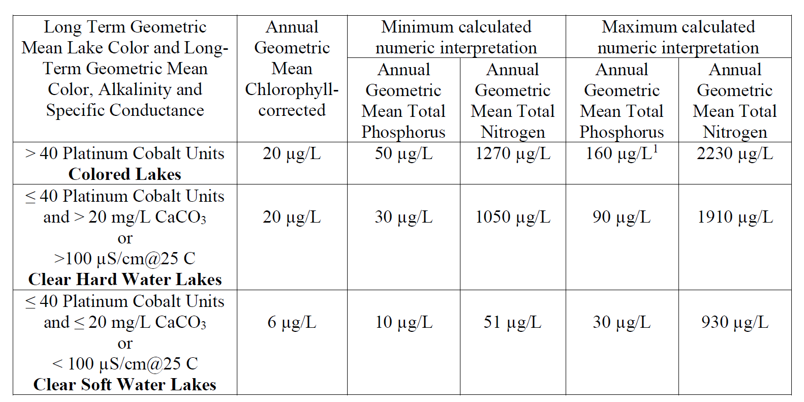
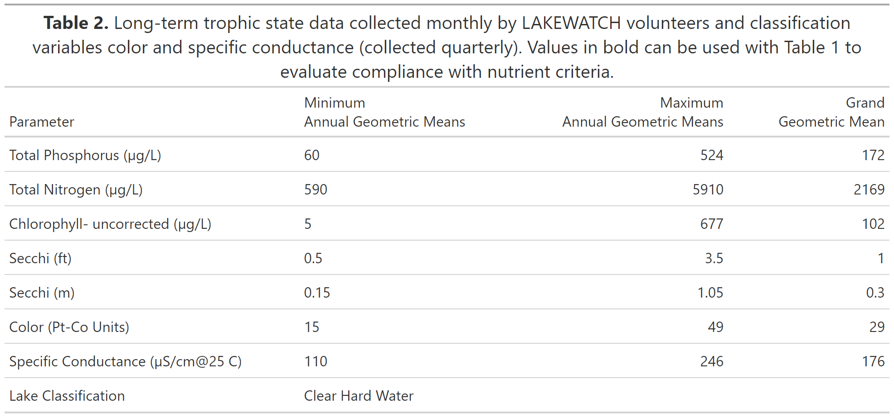
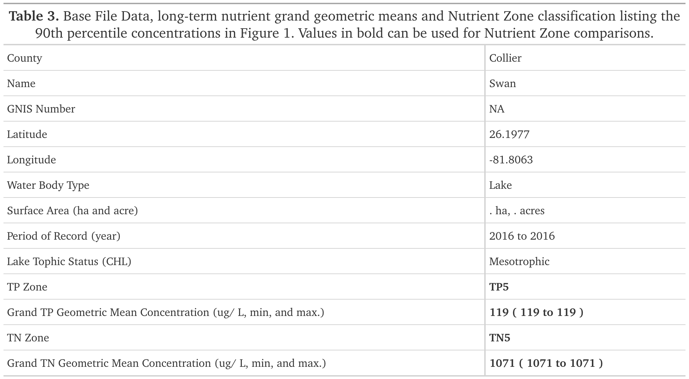
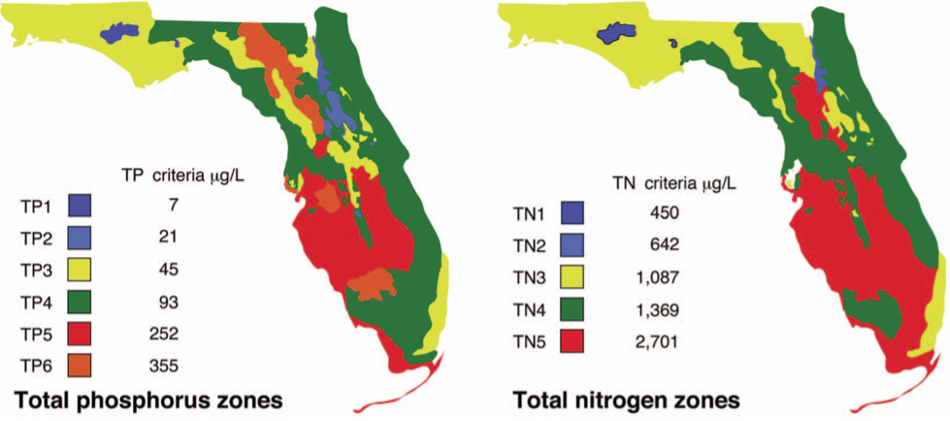

---
output:
  pdf_document: default
  html_document: default
params:
  Lakes: 0
---

```{r tinytex update, include=FALSE}
tinytex::tlmgr_update()
```

```{r document option, include=FALSE}

#this line will hit all code chunks
##change to echo = TRUE to diagnose code issues
knitr::opts_chunk$set(echo = FALSE)
#this will suppress any warning messages related to all the code, including warnings about statistics. 
####change to echo = TRUE to diagnose statistical issues
knitr::opts_chunk$set(warning = FALSE)
#this hids code messages, in particular "`geom_smooth()` using formula = 'y ~ x'" from the graphs
##change to echo = TRUE to diagnose code issues
knitr::opts_chunk$set(message = FALSE)


#have to add this. this code tells rmarkdown to not try remove html tags, allows for use of html to format GT table objects.
options(gt.html_tag_check = FALSE)


```

```{r data_processing,  eval=TRUE}
###IMPORTING LIBRARIES AND LOADING DATA###
##########################################################################################
#Commenting out this code to add to the for loop file
#importing libraries 
#library(tidyverse)
#library(gt)
#library(SciViews)
#library(broom)
#broom is just to get values form lm function in easier to reference from
#library(glue)
#library(ggtext)
#glue and ggtext are for making labels. trying to make labels and get default ggplot functions to correctly parse those labels is a nightmare. ggtext helps by allowing you to use html tags in the labels. glue helps by allowing you to use variables in the labels.
#library(readxl)

### Loading and Preparing Data


 
 #data_1 = read_xlsx("Lakewatch Base File 10-24-2023.xlsx")
 #data_1 <- data_1 %>%
   #mutate(Lake_County = paste(Lake, County)) %>%
   #filter(Study == "LW") %>%
   #filter(`water type` == "Lake") 
# head(data_1)
 
 #data_2 = read.csv("All_Data.csv")
 #data_2 = data_2 %>%
  # mutate(Station = as.character(Station)) %>%
  # mutate(Lake_County = paste(Lake, County)) 
# head(data_2)
 
# data_all <- data_1 %>% full_join(data_2, by = c("Lake_County", "Station"))
 
 #Lake = data_all %>% filter(Lake_County == "Alice Alachua") #subsetting data for lake alice

##################################################################################

###FUNCTIONS###

#calculates geometric mean
gmean <- function(x){
 xc <- x[!is.na(x)]
  xg <- exp(mean(log(xc[xc>0])))
  xg <- round(xg)
  return(xg)
}

#adding a column using if/else for lake classification
##this code currently has no fallback for if the data is missing.
Lake_2 = Lake_2 %>% mutate(lake_class = ifelse(
  gmean(`Color`) > 40, "Colored", ifelse(
    gmean(`Color`) <= 40 & gmean(`Cond_uS`) <= 20, "Clear Soft Water","Clear Hard Water")))

#adding a column using if/else for trophic state

Lake_2 = Lake_2 %>% mutate(trophic_state = ifelse(
 gmean(CHL) < 3, "Oligotrophic", ifelse(
    gmean(CHL) >= 3 & gmean(CHL) < 7, "Mesotrophic", ifelse(
      gmean(CHL) >= 7 & gmean(CHL) < 40, "Eutrophic", "Hypereutrophic"))))


```

```{r title,  echo=FALSE}
report_title = glue::glue("Florida LAKEWATCH Report for Lake {Lake_2$Lake[1]} in {Lake_2$County[1]} 2024")
```

## `r report_title`

### Introduction for Lakes

This report summarizes data collected on systems that have been part of the LAKEWATCH program. Data are from the period of record for individual systems. Part one allows the comparison of data with Florida Department of Environmental Protection's Numeric Nutrient Criteria. Part two allows a comparison of the long-term mean nutrient concentrations with nutrient zone concentrations published by LAKEWATCH staff (Bachmann et al. 2012; <https://lakewatch.ifas.ufl.edu/resources/bibliography/>). Finally, this report examines data for long-term trends that may be occurring in individual systems but only for systems with **five or more years of data**. Step by step instructions on how to use the data tables are provided on page 4 of this report.

### Florida Department of Environmental Protection (FDEP) Nutrient Criteria for Lakes (Table 1)

For lakes, the numeric interpretations of the nutrient criterion in paragraph 62-302.530(47)(b), F.A.C., based on chlorophyll are shown in Table 1. The applicable interpretations for TN and TP will vary on an annual basis, depending on the availability and concentration of chlorophyll data for the lake. The numeric interpretations for TN, TP, and chlorophyll shall not be exceeded more than once in any consecutive three year period.

a.  If annual geometric mean chlorophyll does not exceed the chlorophyll value for one of three lake classification groups listed in the table below, then the TN and TP numeric interpretations for that calendar year shall be the annual geometric means of the maximum calculated numeric interpretation in Table 1.

b.  If there are insufficient data to calculate the annual geometric mean chlorophyll for a given year or the annual geometric mean chlorophyll exceeds the values in Table 1 for the correct lake classification group, then the applicable numeric interpretations for TN and TP shall be the minimum values in Table 1.

### Long-Term Data Summary for Lakes (Table 2): Definitions

-   **Total Phosphorus (µg/L):** Nutrient most often limiting growth of plant/algae.
-   **Total Nitrogen (µg/L):** Nutrient needed for aquatic plant/algae growth but only limiting when nitrogen to phosphorus ratios are generally less than 10 (by mass).
-   **Chlorophyll-uncorrected (µg/L):** Chlorophyll concentrations are used to measure relative abundances of open water algae.
-   **Secchi (ft), Secchi (m):** Secchi measurements are estimates of water clarity.
-   **Color (Pt-Co Units):** LAKEWATCH measures true color, which is the color of the water after particles have been filtered out.
-   **Specific Conductance (µS/cm \@ 25 C):** Measurement of the ability of water to conduct electricity and can be used to estimate the amount of dissolved materials in water.
-   **Lake Classification:** Numeric nutrient criteria for Florida require that lakes must first be classified into one of three group based on color and alkalinity or specific conductance; **colored lakes** (color greater than 40 Pt-Co units), **clear soft water lakes** (color less than or equal to 40 Pt-Co units and alkalinity less than or equal to 20 mg/L as CaCO3 or specific conductance less than or equal to 100 µs/cm @25 C), and **clear hard water lakes** (color less than 40 Pt-Co units and alkalinity greater than 20 mg/L as CaCO3 or specific conductance greater 100 µS/cm \@ 25 C).

### Table 1. Florida Department of Environmental Protection's Numeric Nutrient Criteria for lakes.

```{r table_one_image, echo=FALSE, out.width= "500px", fig.align='center',}




```

[1 For lakes with color \> 40 PCU in the West Central Nutrient Watershed Region, the maximum TP limit shall be the 490 µg/L TP streams threshold for the region.]

For the purpose of subparagraph 62-302.531(2)(b)1., F.A.C., color shall be assessed as true color and shall be free from turbidity. Lake color and alkalinity shall be the long-term geometric mean, based on a minimum of ten data points over at least three years with at least one data point in each year. If insufficient alkalinity data are available, long-term geometric mean specific conductance values shall be used, with a value of \<100 µS/cm\@25 C used to estimate the mg/L CaCO~3~ alkalinity concentration until such time that alkalinity data are available.

```{r table_2_data}


#note: these tables work but it has two issues at the moment
##one is that is is not using the geometric mean, just mean. 
### it is using the min and max value, when we want the min and max mean value across ampling years
#it is also missing the number of sampling years for each variable. i need to work on calculating that. so far i can't figure out how to do that. 
#another issue, how does lakewatch handle bottom in thier reports?
data_means = Lake_2%>% group_by(Lake_County) %>% summarise(
  "Total Phosphorus (µg/L)" = gmean(TP),
  "Total Nitrogen (µg/L)" = gmean(TN),
  "Chlorophyll- uncorrected (µg/L)" = gmean(CHL),
  "Secchi (ft)" = gmean(SECCHI_ft),
  "Secchi (m)" = gmean(SECCHI_ft)*0.3,
  "Color (Pt-Co Units)" = gmean(Color),
  "Specific Conductance (µS/cm@25 C)" = gmean(Cond_uS),
  "Lake Classification" = ""
  ) %>% pivot_longer(cols = 2:9, names_to = "parameter",values_to = "mean",values_transform = list(mean = as.character)) %>% select(-Lake_County)


data_mins = Lake_2 %>% group_by(Lake_County) %>%  summarise(
  "Total Phosphorus (µg/L)" = min(TP, na.rm = TRUE),
  "Total Nitrogen (µg/L)" = min(TN, na.rm = TRUE),
  "Chlorophyll- uncorrected (µg/L)" = min(CHL, na.rm = TRUE),
  "Secchi (ft)" = min(SECCHI_ft, na.rm = TRUE),
  "Secchi (m)" = min(SECCHI_ft, na.rm = TRUE)*0.3,
  "Color (Pt-Co Units)" = min(Color, na.rm = TRUE),
  "Specific Conductance (µS/cm@25 C)" = min(Cond_uS, na.rm = TRUE),
  "Lake Classification" = unique(lake_class) #you must use unique on this character column apparently. otherwise it get much longer than it should be. 
  ) %>% pivot_longer(cols = 2:9, names_to = "parameter",values_to = "min",values_transform = list(min = as.character)) %>% select(-Lake_County)

data_max = Lake_2 %>% group_by(Lake_County) %>% summarise(
  "Total Phosphorus (µg/L)" = max(TP, na.rm = TRUE),
  "Total Nitrogen (µg/L)" = max(TN, na.rm = TRUE),
  "Chlorophyll- uncorrected (µg/L)" = max(CHL, na.rm = TRUE),
  "Secchi (ft)" = max(SECCHI_ft, na.rm = TRUE),
  "Secchi (m)" = max(SECCHI_ft, na.rm = TRUE)*0.3,
  "Color (Pt-Co Units)" = max(Color, na.rm = TRUE),
  "Specific Conductance (µS/cm@25 C)" = max(Cond_uS, na.rm = TRUE),
  "Lake Classification" = ""
  ) %>% pivot_longer(cols = 2:9, names_to = "parameter", values_to = "max",values_transform = list(max = as.character)) %>% select(-Lake_County)


#data_years = data_test %>% group_by(Lake) %>% summarise(
 # "Total Phosphorus (µg/L)" = sum(is.na(TP))

 #this is not correct still, work in progress
 #%>% pivot_longer(cols = 2:8, names_to = "parameter",values_to = "max") %>% select(-Lake)


data_combined = full_join(data_mins,data_max, by = "parameter")
data_combined = full_join(data_combined,data_means, by = "parameter")
```

```{r table_2_gt, echo = FALSE}
table_two <- gt(data = data_combined) %>% cols_label(
  parameter = "Parameter",
  min = "Minimum<br>Annual Geometric Means",
  max = "Maximum<br>Annual Geometric Means",
  mean = "Grand<br>Geometric Mean",
  .fn = md
) %>% fmt_number(
  columns = c(min, max, mean),
  decimals = 1
) %>% opt_table_font(
  stack = "transitional"
) %>% tab_header(
  title = md("**Table 2.** Long-term trophic state data collected monthly by LAKEWATCH volunteers and classification variables color and specific conductance (collected quarterly). Values in bold can be used with Table 1 to evaluate compliance with nutrient criteria."))  


#amber figured this out. if we knit using gttable to pdf we get massive issues. this is because GTtable does not support kniting to pdf. if we save as a png file, knitr can knit this png file to the document just fine. 
gtsave(table_two, filename = "table_2.png", path = "Lake/output_table")


```

```{r table 2, out.width= "500px", fig.align='center'}

```
\newpage
### Base File Data for Lakes: Definitions

-   **County:** Name of county in which the system resides.
-   **Name:** Stream name that LAKEWATCH uses for the system.
-   **GNIS Number:** Number created by USGS's Geographic Names Information System.
-   **Water Body Type:** Four different types of systems; lakes, estuaries, river/streams and springs.
-   **Period of Record (years):** Number of years a system has been in the LAKEWATCH program.
-   **Latitude and Longitude:** Coordinates identifying the exact location of station 1 for each system.
-   **Water Body Type:** Four different types of systems; lakes, estuaries, river/streams and springs.
-   **Surface Area (ha and acre):** LAKEWATCH lists the surface area of a lake if it is available.
-   **Mean Depth (m and ft):** This mean depth is calculated from multiple depth finder transects across a lake that LAKEWATCH uses for estimating plant abundances.
-   **Period of Record (year):** Years a lake has been in the LAKEWATCH program.
-   **TP Zone and TN Zone:** Nutrient zones defined by Bachmann et al (2012).
-   **Long-Term TP and TN Geometric Mean Concentration (µg/L: min and max):** Grand Geometric Means of all annual geometric means (µg/L) with minimum and maximum annual geometric means.
-   **Lake Trophic Status (CHL):** Tropic state classification using the long-term chlorophyll average.

```{r table_3 code}
### TABLE 3 CODE ###

#geometric means by year
byyr <- Lake_2 %>%
  group_by(Year) %>%
  summarize(gmean(TP), gmean(TN), gmean(CHL), gmean(SECCHI_ft))

#total geometric means means 
ggtp <- gmean(byyr$`gmean(TP)`)
ggtn <- gmean(byyr$`gmean(TN)`)
ggchl <- gmean(byyr$`gmean(CHL)`) 
ggsec <- gmean(byyr$`gmean(SECCHI_ft)`)

#calculate TSI
tsi_sd <- 60 -14.41*ln(ggsec)
tsi_chl <- 9.81* ln(ggchl) + 30.6
tsi_tp <- 14.42* ln(ggtp) + 4.15
tsi <- mean(tsi_sd, tsi_chl, tsi_tp)

#define variables
cnty <- Lake_2$County[1] #county
name <- Lake_2$Lake[1] #name
pr <- paste(min(Lake_2$Year), " to ", max(Lake_2$Year)) #period of record
lts <- ifelse(tsi < 40 , "Oligotrophic", 
              (ifelse(tsi < 50 , "Mesotrophic",
               (ifelse(tsi < 70, "Eutrophic", "Hypereutrophic")))))  #lake trophic status
tpz <- Lake_1$`TP Zone`[1] #tp zone
gtp <- paste(ggtp, "(", min(byyr$`gmean(TP)`), " to ", max(byyr$`gmean(TP)`) , ")" ) #grand total phosphorous
tnz <- Lake_1$`TN Zone`[1]
gtn <- paste(ggtn, "(", min(byyr$`gmean(TN)`), " to ", max(byyr$`gmean(TN)`), ")") #grand tn geomean
gnis <- Lake_1$GNIS_ID[1]
lat <- Lake_1$Latitude[1]
long <- Lake_1$Longitude[1]
wbt <- Lake_1$`water type`[1]
sa <- paste(Lake_1$`SA (hectare)`[1], "ha, ", Lake_1$`SA (acres)`[1], "acres")


### IF Statements (Before I had access to the base file).  Will possible use later
# tpz <- ifelse(ggtp >= 355, "TP6", 
#               (ifelse(ggtp >= 252, "TP5",
#                (ifelse(ggtp >= 93, "TP4",
#                 (ifelse(ggtp >= 45, "TP3",
#                  (ifelse(ggtp >= 21, "TP2","TP1"))))))))) #tp zone
# tnz <- ifelse(ggtn >= 2701, "TN6", 
#               (ifelse(ggtn >= 1369, "TN5",
#                (ifelse(ggtn >= 1087, "TN4",
#                 (ifelse(ggtn >= 642, "TN3",
#                  (ifelse(ggtn >= 450, "TN2","TN1"))))))))) #tn zone


#add values to array
rowval <- c(cnty, name, gnis, lat, long, wbt, sa, pr, lts, tpz, gtp, tnz, gtn )

#add row names to array
rowname <- c("County", "Name", "GNIS Number", "Latitude", "Longitude", "Water Body Type", "Surface Area (ha and acre)", "Period of Record (year)", "Lake Tophic Status (CHL)", "TP Zone", "Grand TP Geometric Mean Concentration (ug/ L, min, and max.)", "TN Zone", "Grand TN Geometric Mean Concentration (ug/ L, min, and max.)")

#make dataframe with rownames and row values
tbl3df <- data.frame(rowname, rowval)
#make gt table
table_three = gt(tbl3df) %>% tab_options(column_labels.hidden = TRUE) %>% fmt_number(
  decimals = 4,drop_trailing_zeros = TRUE,
) %>% opt_table_font(
  stack = "transitional"
) %>% tab_header(
  title = md("**Table 3.** Base File Data, long-term nutrient grand geometric means and Nutrient Zone classification listing the 90th percentile concentrations in Figure 1. Values in bold can be used for Nutrient Zone comparisons."))  

gtsave(table_three, filename = "table_3.png", path = "Lake/output_table")

```

```{r table 3, out.width= "500px", fig.align='center'}

```

```{r Figure_one_image, echo=FALSE, out.width= "900px", fig.align='center',}



```

Figure 1. Maps showing Florida phosphorus and nitrogen zones and the nutrient concentrations of the upper 90% of lakes within each zone (Bachmann et al. 2012). Explanation on how to interpret the Nutrient Zones on page 4.

**Interpreting FDEP’s Numeric Nutrient Criteria (NNC): These are instructions for using Table 1 and 2 to determine impairment status based on FDEP’s NNC.**

1.  Identify your lake’s *Lake Classification* in Table 2 (Colored, Clear Hard Water, or Clear Soft Water) (if no classification is listed then there is not enough data available to classify your lake).

    a.  The *Lake Classification* tells you which row to use in Table 1.

2.  Identify your waterbody’s *Grand Geometric Mean* Chlorophyll-uncorrected in Table 2.

    a.  Compare this number to the *Annual Geometric Mean Chlorophyll-corrected* (2^nd^ column) in Table 1.

    b.  If your lake’s Chlorophyll-uncorrected concentration is greater than the *Annual Geometric Mean Chlorophyll-corrected* concentration use the *Minimum calculated numeric interpretation* columns.

    c.  If your lake’s *Chlorophyll-uncorrected* concentration is less than the *Annual Geometric Mean Chlorophyll-corrected* concentration use the *Maximum calculated numeric interpretation* columns.

3.  Identify your lake’s Total Phosphorus and Total Nitrogen *Grand Geometric Mean* concentration in Table 2 and compare them to the appropriate *Annual Geometric Mean Total Phosphorus* and *Annual Geometric Mean Total Nitrogen* values in Table 1.

4.  If your lake’s concentrations from Table 2 are greater than FDEP’s NNC values from Table 1, your lake may be considered impaired. If they are below, it may be considered unimpaired.

**Nutrient Zones and “Natural Background”**

Administrative code definitions 62-302.200 (19): “Natural background” shall mean the condition of waters in the absence of man-induced alterations based on the best scientific information available to the Department. The establishment of natural background for an altered waterbody may be based upon a similar unaltered waterbody, historical pre-alteration data, paleolimnological examination of sediment cores, or examination of geology and soils. When determining natural background conditions for a lake, the lake’s location and regional characteristics as described and depicted in the U.S. Environmental Protection Agency document titled Lake Regions of Florida (EPA/R-97/127, dated 1997, U.S. Environmental Protection Agency, National Health and Environmental Effects Research Laboratory, Corvallis, OR) ([http://www.flrules.org/Gateway/reference.asp?No=Ref-06267),](http://www.flrules.org/Gateway/reference.asp?No=Ref-06267),) which is incorporated by reference herein, shall also be considered. The lake regions in this document are grouped Nutrient Zones according to ambient total phosphorus and total nitrogen concentrations listed in Table 1 found in Bachmann, R. W., Bigham D. L., Hoyer M. V., Canfield D. E, Jr. 2012. A strategy for establishing numeric nutrient criteria for Florida lakes. Lake Reservoir Management. 28:84-92.

**Interpreting Florida LAKEWATCH’s Nutrient Zones: These are instructions for using Table 3 and Figure 1 to determine nutrient status based on Nutrient Zones.**

1.  Identify your lake’s TP Zone in Table 3.

    a.  Locate this TP Zone (left map) and its corresponding nutrient concentration in Figure 1.

2.  Locate your lake’s Long-Term Grand Geometric Mean TP Concentration value in Table 3.

3.  Compare your lake’s Long-Term Grand Geometric Mean TP Concentration from Table 3 to the appropriate TP Zone nutrient concentration from Figure 1.

    a.  If your lake’s Long-Term Grand Geometric Mean TP Concentration number is higher than the TP zone nutrient concentration, your lake’s nutrient concentration is above “Natural Background”.

    b.  If your lake’s Long-Term Grand Geometric Mean TP Concentration number is lower than the TP zone nutrient concentration, your lake’s nutrient concentration is within “Natural Background”.

4.  Repeat these same steps with the TN Zone and Long-term Grand Geometric Mean TN Concentration.
\newpage
Figure 2 and Figure 3. Trend plots of annual average total phosphorus and annual average total nitrogen versus year. The R2 value indicates the strength of the relations (ranges from 0.0 to 1.0; higher the R2 the stronger the relation) and the p value indicates if the relation is significant (p \< 0.05 is significant). Trend Status are reported on plots.

```{r p_graph}

#lm for graph to refer to 

total_p_lm = lm(TP ~ Year, data = Lake_2)

total_p_table = glance(total_p_lm)

trend = if_else(total_p_table$p.value >= 0.5, true = "No trend", false = if_else(total_p_lm[["coefficients"]][["Year"]] > 0 , true = "Increasing", false = "Decreasing"))
  
plot_title = glue("Total Phosphorus (µg/L) by Year for Lake {Lake_2$Lake[1]} in {Lake_2$County[1]} County")  
  

label = (glue("p = {signif(total_p_table$p.value, digits = 2)}, R<sup>2</sup> = {signif(total_p_table$r.squared, digits = 2)}, {trend} "))

maxlim = max(Lake_2$TP)+10
minlim = min(Lake_2$TP)

total_p_graph = ggplot(data = Lake_2, aes(x = Year, y = TP)) +
  geom_point() +
  geom_smooth(
    method = "lm", 
    se = TRUE, alpha=0.15,
    linetype = paste(
      if_else(total_p_table$p.value <= 0.05,true = "solid", false = "dashed" )
      )
    ) +
  labs(title = plot_title, x = "Year", y = "Total Phosphorus (µg/L)")+
  theme_bw() +
  theme(plot.title = element_text(hjust = 0.5)) + geom_richtext(
    label = label
    ,x = (min(Lake_2$Year, na.rm = TRUE)+5),
    y = (max(Lake_2$TP, na.rm = TRUE)+5),
    )+ylim(minlim, maxlim)


#show(total_p_graph)
##commented out so the graph does not show up twice. 


#we decided to save as a png file due to issues with knitr rendering the graph when knitting. it seems to understand how to knit a png file more consistently. 
ggsave("Lake/output_graphs/total_p_graph.png", width = 6, height = 4, units = "in", dpi = 300)

```

```{r total p graph out, out.width= "400px",fig.align = "center"}

knitr::include_graphics("Lake/output_graphs/total_p_graph.png")
```

```{r n_graph}
total_n_lm = lm(TN ~ Year, data = Lake_2)

total_n_table = glance(total_n_lm)

trend = if_else(total_n_table$p.value >= 0.05, true = "No trend", false = if_else(total_n_lm[["coefficients"]][["Year"]] > 0 , true = "Increasing", false = "Decreasing"))
  
plot_title = glue("Total Nitrogen (µg/L) by Year for Lake {Lake_2$Lake[1]} in {Lake_2$County[1]} County")  
  

label = (glue("p = {signif(total_n_table$p.value, digits = 2)}, R<sup>2</sup> = {signif(total_n_table$r.squared, digits = 2)}, {trend} "))

maxlim = max(Lake_2$TN)+10
minlim = min(Lake_2$TN)

total_n_graph = ggplot(data = Lake_2, aes(x = Year, y = TN)) +
  geom_point() +
  geom_smooth(
    method = "lm", 
    se = FALSE, 
    linetype = paste(
      if_else(total_n_table$p.value <= 0.5,true = "solid", false = "dashed" )
      )
    ) +
  labs(title = plot_title, x = "Year", y = "Total Nitrogen (µg/L)")+
  theme_bw() +
  theme(plot.title = element_text(hjust = 0.5)) + geom_richtext(
    label = label
    ,x = (min(Lake_2$Year, na.rm = TRUE)+5),
    y = (max(Lake_2$TN, na.rm = TRUE)+5),
    )+ylim(minlim, maxlim)


#show(total_n_graph)
##commented out so the graph does not show up twice.

ggsave("Lake/output_graphs/total_n_graph.png", width = 6, height = 4, units = "in", dpi = 300)


```

```{r total n graph out, out.width= "400px",fig.align = "center"}

knitr::include_graphics("Lake/output_graphs/total_n_graph.png")

```
\newpage
Figure 4 and Figure 5. Trend plots of annual average chlorophyll and annual average Secchi versus year. The R2 value indicates the strength of the relations (ranges from 0.0 to 1.0; higher the R2 the stronger the relations and the p value indicates if the relation is significant (p \< 0.05 is significant). Trend status are reported on plots.

```{r chl_graph}
total_chl_lm = lm(CHL ~ Year, data = Lake_2)

total_chl_table = glance(total_chl_lm)

trend = if_else(total_chl_table$p.value >= 0.05, true = "No trend", false = if_else(total_chl_lm[["coefficients"]][["Year"]] > 0 , true = "Increasing", false = "Decreasing"))
  
plot_title = glue("Total Chlorophyll (µg/L) by Year for Lake {Lake_2$Lake[1]} in {Lake_2$County[1]} County")  
  

label = (glue("p = {signif(total_chl_table$p.value, digits = 2)}, R<sup>2</sup> = {signif(total_chl_table$r.squared, digits = 2)}, {trend} "))

maxlim = max(Lake_2$CHL)+10
minlim = min(Lake_2$CHL)

total_chl_graph = ggplot(data = Lake_2, aes(x = Year, y = CHL)) +
  geom_point() +
  geom_smooth(
    method = "lm", 
    se = FALSE, 
    linetype = paste(
      if_else(total_chl_table$p.value <= 0.05,true = "solid", false = "dashed" )
      )
    ) +
  labs(title = plot_title, x = "Year", y = "Total Chlorophyll (µg/L)")+
  theme_bw() +
  theme(plot.title = element_text(hjust = 0.5)) + geom_richtext(
    label = label
    ,x = (min(Lake_2$Year,na.rm = TRUE)+5),
    y = (max(Lake_2$CHL, na.rm = TRUE)+5),
    )+ylim(minlim, maxlim)

#show(total_chl_graph)
##commented out so the graph does not show up twice.
ggsave("Lake/output_graphs/total_chl_graph.png", width = 6, height = 4, units = "in", dpi = 300)

```

```{r chl graph out, out.width= "400px",fig.align = "center"}

knitr::include_graphics("Lake/output_graphs/total_chl_graph.png")

```

```{r secchi_graph}
total_secchi_lm = lm(SECCHI_ft ~ Year, data = Lake_2)

total_secchi_table = glance(total_secchi_lm)

trend = if_else(total_secchi_table$p.value >= 0.5, true = "No trend", false = if_else(total_secchi_lm[["coefficients"]][["Year"]] > 0 , true = "Increasing", false = "Decreasing"))
  
plot_title = glue("Secchi Depth (ft) by Year for Lake {Lake_2$Lake[1]} in {Lake_2$County[1]} County")  
  

label = (glue("p = {signif(total_secchi_table$p.value, digits = 2)}, R<sup>2</sup> = {signif(total_secchi_table$r.squared, digits = 2)}, {trend} "))

maxlim = max(Lake_2$SECCHI_ft, na.rm = TRUE)+10
minlim = min(Lake_2$SECCHI_ft, na.rm = TRUE)

total_secchi_graph = ggplot(data = Lake_2, aes(x = Year, y = SECCHI_ft)) +
  geom_point() +
  geom_smooth(
    method = "lm", 
    se = FALSE, 
    linetype = paste(
      if_else(total_secchi_table$p.value <= 0.5,true = "solid", false = "dashed" )
      )
    ) +
  labs(title = plot_title, x = "Year", y = "Secchi depth (ft)")+
  theme_bw() +
  theme(plot.title = element_text(hjust = 0.5)) + geom_richtext(
    label = label,
    x = (min(Lake_2$Year, na.rm = TRUE)+5),
    y = (max(Lake_2$SECCHI_ft, na.rm = TRUE)+5)
    )+ylim(minlim, maxlim)
  


#show(total_secchi_graph)
###commented out so the graph does not show up twice.
ggsave("Lake/output_graphs/total_secchi_graph.png", width = 6, height = 4, units = "in", dpi = 300)

```

```{r secchi_graph out, out.width= "400px",fig.align = "center"}

knitr::include_graphics("Lake/output_graphs/total_secchi_graph.png")


```
